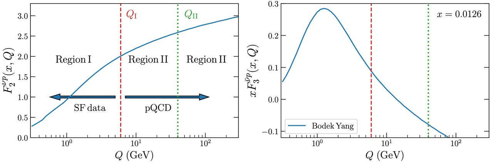

<h1 align="center">NνSF</h1>

NνSF is a python module that provides predictions for (anti-)neutrino structure
functions at all energies. It relies on [Yadism](https://github.com/N3PDF/yadism)
for the description of the medium- and large-$Q^2$ regions while the low-$Q^2$
regime is modelled in terms of a Neural Network (NN).

 

 
 

The low- and intermediate-$Q^2$ regions we construct a parametrisation of the neural
network structure functions with its associated uncertainties by training a machine
learning model to available experimental data. Given an observable $\mathcal{O}$
that is defined as a linear combination of structure functions:
$$
\mathcal{O} = N
\left(
C_1 F_2^{\nu} + C_2 F_2^{\bar{\nu}} +
C_3 F_L^{\nu} + C_4 F_L^{\bar{\nu}} +
C_5 x F_3^{\nu} + C_6 x F_3^{\bar{\nu}}
\right),
$$
we fit the structure functions $F_i^{k} \equiv F_i^{k} \left( x, Q^2, A \right)$
for $i=2, 3, L$ and $k =\nu, \bar{\nu} $. Note that for $i = 3$ we actually fit
$xF_3$ instead of $F_3$. The coefficients $C_j$ which depend on $(x, Q^2, y)$ are
computed using Yadism and they have to match data point per data point to the
experimental data sets.
