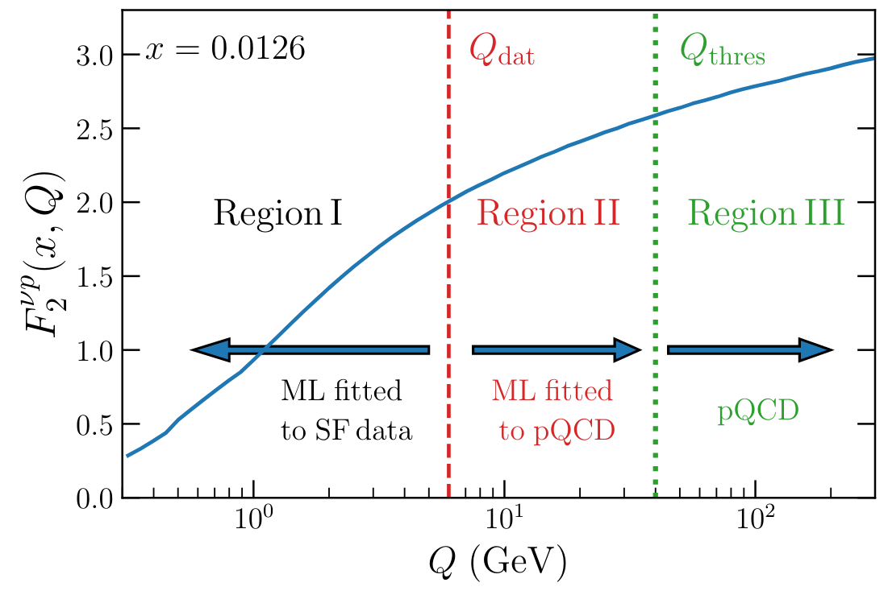
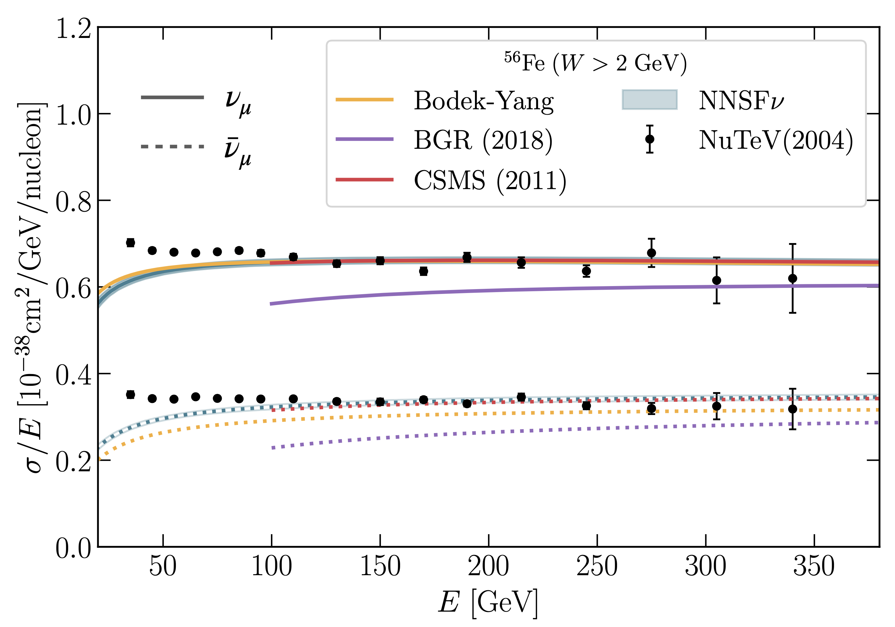

Description
===========

NNSFν is a python package that can be used to compute (anti-)neutrino structure
functions at all energies. It relies on `Yadism <https://github.com/N3PDF/yadism>`_
for the description of the medium- and large-:math:`Q^2` regions while the 
low-:math:`Q^2` regime is modelled in terms of a Neural Network (NN).

In the low- and intermediate-:math:`Q^2` regions we construct a parametrisation of
the neural network structure functions with its associated uncertainties by training
a machine learning model to available experimental data. That is, given an observable
:math:`\mathcal{O}` that is defined as a linear combination of structure functions:

.. math::
   \mathcal{O} = N
   \left(
   C_1 F_2^{\nu} + C_2 F_2^{\bar{\nu}} +
   C_3 F_L^{\nu} + C_4 F_L^{\bar{\nu}} +
   C_5 x F_3^{\nu} + C_6 x F_3^{\bar{\nu}}
   \right),

we fit the structure functions :math:`F_i^{k} \equiv F_i^{k} \left( x, Q^2, A \right)`
for :math:`i=2, 3, L` and :math:`k =\nu, \bar{\nu}`. Note that for :math:`i = 3` we
actually fit :math:`xF_3` instead of :math:`F_3`. The coefficients :math:`C_j` which
depend on :math:`(x, Q^2, y)` are computed using Yadism and they have to match data
point per data point to the experimental datasets while the normalisation :math:`N`
depends on how the observable is measured experimentally.

The resulting predictions from NNSFν is also made available in terms of fast interpolation
`LHAPDF <https://lhapdf.hepforge.org/>`_ grids that can be accessed through an independent
driver code and directly interfaced to the `GENIE <http://www.genie-mc.org/>`_ Monte Carlo
event generator.

